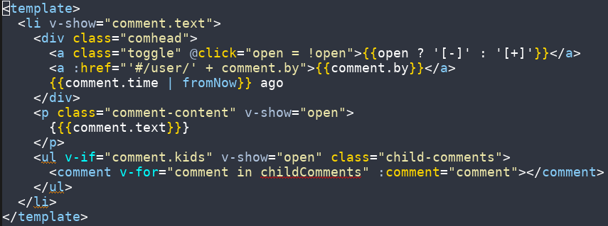

# vue-html-mode
Vue template support for Emacs

## Installation & Usage
vue-html-mode is on MELPA. Type `M-x package-install <RET> vue-html-mode <RET>`
to install it.

Vue component files are best edited with the excellent [vue-mode](https://github.com/CodeFalling/vue-mode),
which the author of this package also contributes to. This mode is included in 
vue-mode, and is the default mode for editing template blocks.

## Functions
- `vue-html-mode` - Enable Vue HTML Template mode

## Contributing
If you want to see a function or a feature in this mode, feel free to open an
issue or a pull request. I hope to eventually add support for chained filters
in mustache interpolation, and a few more functions.

## License
GPLv3+
